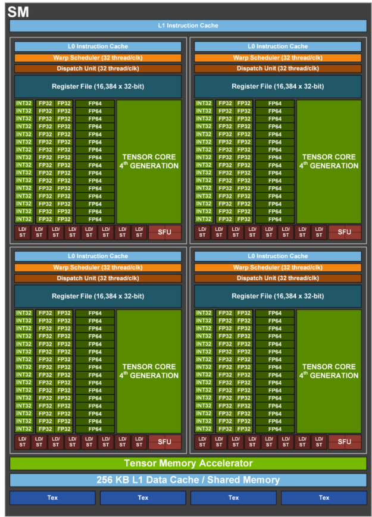

# Notes about CUDA

## Architecture
GPU consists of multiple GPC (Graphics Processing Clusters)  
Each GPC has raster engine and multiple TPC (Texture Processing Clusters)  
Each TPC has multiple SM (Streaming MultiProcessors)  
SM = all the CUDA cores, Tensor cores, etc. Essentially does all the computing.   
Referred as SMM or SMX as well depending on architecture  
Has different cores specialized for things like tensor ops, floating point, integer  
Has SFUs specialized for mathematical ops like trigonometric functions  

## Device Memory Management
- Global Memory = where all variables live and all threads can access
- Constant Memory = 
- Local Memory = 
- Texture Memory = 
- Register = Each thread has their own set of registers
Shared Memory (L1 Cache) = located in each SM for inter-thread communication in a block
- L2 Cache = 
- Unified Memory = CPUs and GPUs see a single coherent image with common address space. This is basically virtual memory that needs to be in both Systems DRAM and GPUs VRAM

## Vocab
Warp = group of GPU threads that are grouped physically. All threads in warp execute same instructions  
Stream = sequence of asynchronous operations that execute on the device in the order in which they are issued by the host code. While operations within a stream are guaranteed to execute in the prescribed order, operations in different streams can be interleaved and, when possible, they can even run concurrently. When no stream is specified, the default stream (also called the “null stream”) is used. The default stream is different from other streams because it is a synchronizing stream with respect to operations on the device: no operation in the default stream will begin until all previously issued operations in any stream on the device have completed, and an operation in the default stream must complete before any other operation (in any stream on the device) will begin. The non-default streams can be used. The most common use of non-default streams is for overlapping computations and data movements.  

